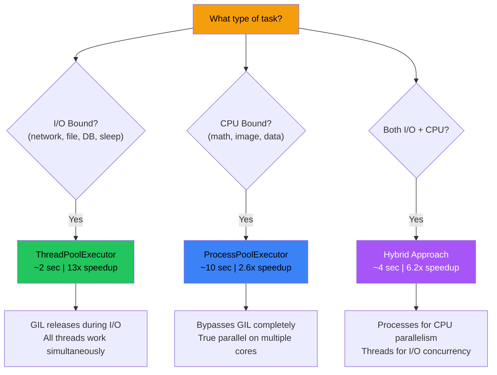

# Python Parallelism — Visual Guide

> [!TIP]
> Same problem: **14 tasks, each takes 2 seconds**. Four different approaches.

---

## 1. Sequential — No Parallelism (28 seconds)

```
Time:  0s    2s    4s    6s    8s   10s   12s   14s   16s   18s   20s   22s   24s   26s   28s
       |-----|-----|-----|-----|-----|-----|-----|-----|-----|-----|-----|-----|-----|-----|
       [T1 ] [T2 ] [T3 ] [T4 ] [T5 ] [T6 ] [T7 ] [T8 ] [T9 ] [T10] [T11] [T12] [T13] [T14]

       ← One task at a time. Next waits for previous to finish →
       Result: 14 × 2s = 28 seconds | Speedup: 1.0x
```

---

## 2. ThreadPool — 14 Threads (2 seconds)

```
Time:  0s              2s
       |----------------|
T1     [██████████████████]  ← All 14 threads
T2     [██████████████████]     start at the SAME TIME!
T3     [██████████████████]
T4     [██████████████████]     During time.sleep() (I/O wait),
T5     [██████████████████]     GIL is RELEASED, so all threads
T6     [██████████████████]     can sleep simultaneously.
T7     [██████████████████]
T8     [██████████████████]     Think of it like:
T9     [██████████████████]     14 people each placing an order
T10    [██████████████████]     at a restaurant — they ALL wait
T11    [██████████████████]     for food at the same time.
T12    [██████████████████]
T13    [██████████████████]
T14    [██████████████████]

Result: 2 seconds | Speedup: 13.0x | BEST for I/O tasks!
```

---

## 3. ProcessPool — 3 Processes (10 seconds)

```
Time:     0s    2s    4s    6s    8s    10s
          |-----|-----|-----|-----|------|
Proc 1:   [T1 ] [T4 ] [T7 ] [T10] [T13]     ← 3 tasks run
Proc 2:   [T2 ] [T5 ] [T8 ] [T11] [T14]        at a time
Proc 3:   [T3 ] [T6 ] [T9 ] [T12]              (3 workers)
          |     |     |     |     |
         Batch Batch Batch Batch Batch
          1     2     3     4     5

Each process has its OWN GIL → True parallel on separate CPU cores
But only 3 workers → 5 batches × 2s = 10 seconds

Result: 10 seconds | Speedup: 2.6x
```

---

## 4. Hybrid — 3 Processes × 3 Threads (4 seconds)

```
Time:     0s              2s              4s
          |----------------|---------------|

          ┌─ Process 1 (PID: 16828) ── Own GIL ─┐
          │  Thread A: [T1 ████████████]         │
          │  Thread B: [T2 ████████████]         │
          │  Thread C: [T3 ████████████] [T4 ██] │
          │  Thread A:                   [T5 ██] │
          └──────────────────────────────────────┘

          ┌─ Process 2 (PID: 12580) ── Own GIL ─┐
          │  Thread A: [T6 ████████████]         │
          │  Thread B: [T7 ████████████]         │
          │  Thread C: [T8 ████████████] [T9 ██] │
          │  Thread A:                   [T10 █] │
          └──────────────────────────────────────┘

          ┌─ Process 3 (PID: 14316) ── Own GIL ─┐
          │  Thread A: [T11 ███████████]         │
          │  Thread B: [T12 ███████████]         │
          │  Thread C: [T13 ███████████]         │
          │  Thread A: [T14 ███████████]         │
          └──────────────────────────────────────┘

9 workers total (3 × 3) = ~2 batches
Result: 4 seconds | Speedup: 6.2x
```

---

## The GIL Explained Visually

```
                    ┌────────────────────────────────────────────┐
                    │             SINGLE PROCESS                 │
                    │                                            │
                    │   ┌─────┐  ┌─────┐  ┌─────┐              │
                    │   │ T1  │  │ T2  │  │ T3  │  ← Threads   │
                    │   └──┬──┘  └──┬──┘  └──┬──┘              │
                    │      │       │       │                    │
                    │      └───┬───┘───┬───┘                    │
                    │          │       │                         │
                    │       ┌──▼──┐    │                         │
                    │       │ GIL │ ◄──┘   Only ONE thread      │
                    │       │LOCK │        can hold GIL          │
                    │       └──┬──┘        at a time!            │
                    │          │                                 │
                    │       ┌──▼──┐                              │
                    │       │ CPU │   Single core execution      │
                    │       └─────┘                              │
                    └────────────────────────────────────────────┘

    BUT during I/O (sleep, network, file read):
    ┌──────────────────────────────────────────────────────┐
    │  Thread 1: [CPU work]──►[I/O wait... GIL released]  │
    │  Thread 2:    waiting ──►[CPU work]──►[I/O wait...] │
    │  Thread 3:       waiting ──►waiting──►[CPU work]    │
    │                                                      │
    │  GIL switches AUTOMATICALLY during I/O!              │
    └──────────────────────────────────────────────────────┘
```

---

## Multiprocessing Bypasses GIL

```
    ┌──────────────────┐  ┌──────────────────┐  ┌──────────────────┐
    │   PROCESS 1      │  │   PROCESS 2      │  │   PROCESS 3      │
    │                  │  │                  │  │                  │
    │  ┌────┐ ┌────┐  │  │  ┌────┐ ┌────┐  │  │  ┌────┐ ┌────┐  │
    │  │ T1 │ │ T2 │  │  │  │ T3 │ │ T4 │  │  │  │ T5 │ │ T6 │  │
    │  └─┬──┘ └─┬──┘  │  │  └─┬──┘ └─┬──┘  │  │  └─┬──┘ └─┬──┘  │
    │    └──┬───┘     │  │    └──┬───┘     │  │    └──┬───┘     │
    │    ┌──▼──┐      │  │    ┌──▼──┐      │  │    ┌──▼──┐      │
    │    │GIL 1│      │  │    │GIL 2│      │  │    │GIL 3│      │
    │    └──┬──┘      │  │    └──┬──┘      │  │    └──┬──┘      │
    │    ┌──▼──┐      │  │    ┌──▼──┐      │  │    ┌──▼──┐      │
    │    │Core1│      │  │    │Core2│      │  │    │Core3│      │
    │    └─────┘      │  │    └─────┘      │  │    └─────┘      │
    └──────────────────┘  └──────────────────┘  └──────────────────┘
    Separate memory          Separate memory       Separate memory
    Separate GIL             Separate GIL          Separate GIL

    ✓ TRUE parallelism — each process runs on different CPU core!
```

---

## Decision Flowchart



---

## Speedup Comparison

```
Approach                    Time        Speedup Bar
─────────────────────────────────────────────────────────────────
Sequential                 28.09s      █ 1.0x
ProcessPool (3 proc)       10.61s      ███ 2.6x
Hybrid (3×3)                4.54s      ██████ 6.2x
ThreadPool (14 threads)     2.15s      █████████████ 13.0x  ← WINNER
─────────────────────────────────────────────────────────────────
```

> [!IMPORTANT]
> ThreadPool wins here because `time.sleep()` is **I/O-bound**. For **CPU-bound** work (actual math), ProcessPool would win because threads can't bypass the GIL for CPU operations!
